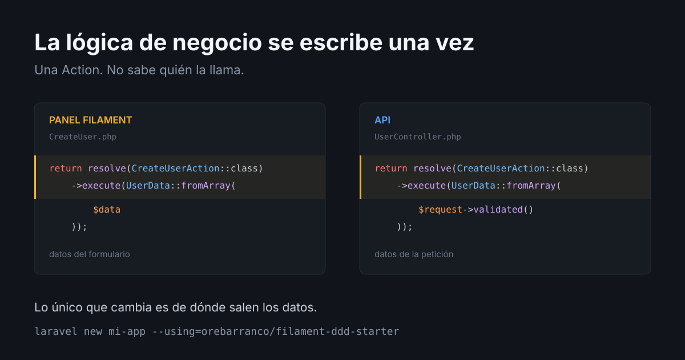

# filament-ddd-starter

[](https://github.com/orebarranco/filament-ddd-starter/actions/workflows/ci.yml)
[](LICENSE)

Starter kit de producción para Laravel basado en **FilamentPHP v5** con arquitectura **Domain-Driven Design**.

Pensado para proyectos en español: el panel, los mensajes de validación y los datos
de prueba vienen en español de fábrica (`APP_LOCALE=es`, `APP_FAKER_LOCALE=es_ES`).
Para cambiarlo, ajusta esas variables en tu `.env`.



## La lógica de negocio se escribe una vez

Un caso de uso vive en una Action, y la Action no sabe quién la llama. El panel de
Filament la consume hoy; una API, un comando de consola o un job la consumen mañana
sin reescribir ni adaptar nada.

Así crea un usuario el panel — es el fichero completo, no un extracto:

```php
// app/Filament/Resources/Users/Pages/CreateUser.php
protected function handleRecordCreation(array $data): Model
{
    return resolve(CreateUserAction::class)->execute(UserData::fromArray($data));
}
```

Y así lo haría un controlador de API. Este fichero **no está en el kit** —no trae capa
HTTP— pero no hace falta tocar el dominio para escribirlo:

```php
public function store(StoreUserRequest $request): JsonResource
{
    $user = resolve(CreateUserAction::class)->execute(UserData::fromArray($request->validated()));

    return new UserResource($user);
}
```

La misma Action, el mismo DTO, la misma línea. Lo único que cambia es de dónde salen los
datos: del formulario o de la petición. Ahí está la diferencia con un CRUD de Filament
donde la lógica vive dentro de la Page: ese código no se puede llamar desde otro sitio, y
cuando llega la API se copia.

Las Actions no importan nada de Filament ni de HTTP:

```php
public function execute(UserData $data): User               // CreateUserAction
public function execute(User $user, UserData $data): User   // UpdateUserAction
public function execute(User $user): bool                   // DeleteUserAction
```

No es una promesa: los tests unitarios ya son ese segundo consumidor. Llaman a
`resolve(CreateUserAction::class)->execute($data)` sin panel, sin Livewire y sin HTTP.

**La costura honesta**: `Domain\Identity\Models\User` sí implementa `FilamentUser` y su
`canAccessPanel()` recibe un `Filament\Panel`. Es el único punto de todo `src/Domain/`
que conoce Filament, y es deliberado: el contrato de acceso al panel tiene que vivir en
el modelo. Las Actions y los DTO quedan limpios.

## Arquitectura

> Basada en **Laravel Beyond CRUD** de Brent Roose (Spatie).

La lógica de negocio vive en `src/Domain/`, completamente separada de la capa HTTP y de Filament:

```
src/Domain/
└── Identity/           ← Dominio de usuarios y roles
    ├── Actions/        ← Casos de uso (CreateUserAction, UpdateUserAction…)
    ├── DataTransferObjects/   ← UserData (readonly, fromArray)
    └── Models/         ← User (Eloquent puro)

app/Filament/Resources/ ← UI delegando a Domain Actions
app/Policies/           ← Autorización vía Spatie Permission
```

### Flujo de una operación

```
Filament Page → DTO::fromArray($data) → resolve(XxxAction::class)->execute(dto) → Model
```

Las Pages de Filament solo construyen el DTO y delegan. Nunca contienen lógica de negocio.

## Stack

| Capa | Tecnología |
|------|------------|
| Framework | Laravel 13, PHP 8.4 |
| Admin UI | Filament 5 (Livewire 4 + Alpine.js + Tailwind v4) |
| Auth / RBAC | Spatie Permission + Filament Shield |
| Testing | Pest 4 |
| Formatter | Laravel Pint |
| Análisis estático | Rector 2 + Larastan 3 (PHPStan) |

## Instalación

```bash
laravel new mi-proyecto --using=orebarranco/filament-ddd-starter
cd mi-proyecto
npm install && npm run build

# Servidor de desarrollo
composer run dev
```

`laravel new` ya deja el proyecto arrancado: copia `.env`, genera la clave,
migra y siembra. Esos pasos viven en `post-create-project-cmd` dentro de
`composer.json`; no hace falta repetirlos a mano.

El panel de administración queda en `/admin`.

## Primer arranque

El sembrado crea el catálogo de permisos, el rol `super_admin` y el primer
administrador:

```
admin@example.com / password
```

El catálogo lo siembra `database/seeders/ShieldSeeder.php`. `super_admin` no
lleva ninguno de esos permisos y no le hacen falta: entra por el gate de Shield,
que se resuelve antes de consultar cualquier policy. Están ahí para los roles
limitados que definas tú.

**Cámbialos antes de exponer el panel a cualquier red.** Están en
`database/seeders/SuperAdminSeeder.php`.

### Para entrar al panel hace falta un rol

`User::canAccessPanel()` exige dos cosas: que la cuenta esté activa y que tenga
**al menos un rol asignado**. Un usuario recién creado sin rol no entra, y es
deliberado: el rol es lo que responde qué puede hacer, y la columna `active` es
el interruptor de la cuenta. Son dos preguntas distintas.

Eso tiene dos efectos que conviene saber, porque no parecen lo que son:

- **La recuperación de contraseña no avisa a quien no puede entrar.** Filament
  comprueba el acceso antes de enviar el correo y, si falla, no envía nada y
  responde igual que si lo hubiera enviado, para no revelar qué direcciones
  existen. Si el enlace no llega, asigna un rol o reactiva la cuenta.
- **Con `MAIL_MAILER=log`, que es el valor de `.env.example`, el correo de
  recuperación se escribe en `storage/logs/laravel.log`** en vez de enviarse.
  En una instalación nueva es ahí donde hay que buscarlo.

### Al añadir un Resource, regenera los permisos

```bash
php artisan shield:generate --resource=NombreResource --panel=admin --no-interaction
php artisan shield:seeder --force --no-interaction
```

El segundo comando es el que se olvida. `shield:generate` crea los permisos en
**tu** base de datos; `shield:seeder` los vuelca a `ShieldSeeder.php` para que
viajen en el repositorio y existan también en las demás instalaciones. Sin él,
el resource nuevo funciona en tu máquina y en ningún otro sitio.

No hace falta que te acuerdes: `ShieldSeederTest` compara lo que Shield descubre
hoy contra lo que el seeder siembra, y falla nombrando los permisos que falten.

Y conecta la policy al modelo con `#[UsePolicy(...)]`. **Sin ese atributo la
autorización falla abierto**: los modelos viven en `Domain\{Dominio}\Models\`,
el autodescubrimiento de Laravel no los encuentra, y Filament interpreta la
ausencia de policy como permiso concedido. El paso a paso está en
`.claude/rules/ddd.md`.

### Copias de seguridad

Vienen programadas pero **apagadas**. Para encenderlas:

```dotenv
BACKUP_SCHEDULE_ENABLED=true
BACKUP_NOTIFICATIONS_EMAIL=tu@ejemplo.com
```

El calendario está en `routes/console.php`: limpieza y monitorización diarias,
y dos copias al día.

## Crear un nuevo dominio

```bash
php artisan domain:make NombreDominio
```

Ver `.claude/rules/ddd.md` para el paso a paso completo.

## Comandos frecuentes

```bash
# Entorno de desarrollo (server + queue + pail + vite, en paralelo)
composer dev

# Aplicar formato y refactor (pint + rector, modifica archivos)
composer lint

# Verificar sin modificar (pint --test + rector --dry-run)
composer test:lint

# Solo tests (Pest en paralelo)
composer test:unit

# Suite completa: tests + lint (lo que corre en CI)
composer test

# Análisis estático con Larastan
composer analyse

# Listar rutas del panel
php artisan route:list --path=admin --except-vendor
```

## Convenciones

- Usar `resolve()` (no `app()` ni `new`) para instanciar Actions.
- Toda nueva funcionalidad requiere test Pest antes de hacer merge.
- Las convenciones de código viven en `.claude/rules/`: `ddd.md`,
  `filament.md`, `testing.md` y `comments.md`. Aplican con agente y sin él.

## Contribuir

El flujo de trabajo —ramas, commits, orden de los quality gates y estrategia de
merge— está en [CONTRIBUTING.md](CONTRIBUTING.md). Los cambios de cada versión,
en [CHANGELOG.md](CHANGELOG.md).

## Licencia

MIT. Ver [LICENSE](LICENSE).
